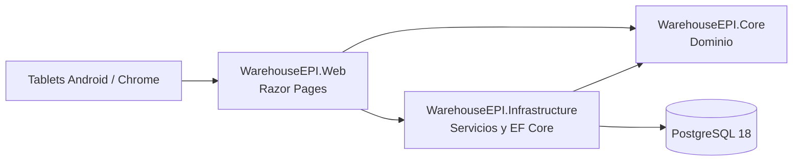

# Arquitectura de Warehouse EPI

## Proposito

Warehouse EPI registra y consulta movimientos de un unico almacen dentro de una
red local. La laptop actua como servidor; tablets Android con Chrome consumen
una interfaz ligera orientada a escaner y captura rapida.

## Limites de proyectos

- **Core** define entidades, enumeraciones, normalizacion y reglas sin
  dependencia de interfaz ni PostgreSQL.
- **Infrastructure** contiene `WarehouseDbContext`, mapeos EF Core, seguridad
  de NIP, importacion y servicios transaccionales.
- **Web** contiene Razor Pages, autenticacion administrativa por cookie,
  presentacion y composicion de dependencias.
- **Tests** valida dominio, seguridad, catalogos, rutas web y concurrencia real
  contra PostgreSQL aislado.

## Perimetro de seguridad de produccion

La laptop publica Kestrel directamente en la LAN con TLS 1.2/1.3, certificado
emitido por una CA local y nombre `warehouse-epi` más IP reservada. El proceso
web no confía en encabezados reenviados hasta que exista un proxy explícito.

Las cookies administrativas y antiforgery son `__Host-`, seguras y estrictas.
Data Protection persiste sus claves protegidas con DPAPI en una ruta ACL privada
para conservar sesiones entre reinicios. La capa web aplica CSP sin scripts
inline, encabezados defensivos, respuestas HTML sin caché y límites por IP solo
para POST.

PostgreSQL separa el rol de ejecución `warehouse_epi_app` del administrador de
migraciones. El primero recibe DML y secuencias sobre `public`, pero no puede
crear, alterar, truncar ni eliminar objetos de esquema.

## Observabilidad local

En producción, la aplicación escribe eventos JSON acotados en
`C:\ProgramData\WarehouseEPI\Logs`; el directorio se crea fuera del repositorio
con ACL para la cuenta de aplicación y administradores. La salida admite solo
metadatos seguros de solicitud y falla, por lo que nunca contiene query string,
NIP, cookies, formularios, secretos, cadenas de conexión ni excepciones crudas.

El middleware emite y devuelve `X-Correlation-ID` UUID por solicitud. La única
ruta de health sin autenticación es `/health/live`, restringida a loopback y
limitada a la salud del proceso. PostgreSQL se consulta mediante una operación
de conectividad sin escritura; su resultado y los conteos agregados se muestran
solo a ADMIN en `/Admin/System`, junto con un buffer acotado de fallas
sanitizadas.

## Publicación y servicio

La aplicación se publica autocontenida para `win-x64` y cada versión vive en
`C:\ProgramData\WarehouseEPI\Releases\<version>`. El servicio Windows
`WarehouseEPI` ejecuta una carpeta concreta con la cuenta virtual
`NT SERVICE\WarehouseEPI`; no compila ni escribe dentro de la Release.

La configuración protegida reside en
`C:\ProgramData\WarehouseEPI\Config\service-settings.json`. El servicio recibe
solo lectura de configuración/certificado y modificación de logs y Data
Protection. El despliegue verifica hashes, certificado, rutas y conectividad
PostgreSQL sin migrar. La activación requiere health local; ante fallo se vuelve
al ejecutable anterior.

La dependencia permitida es `Web -> Infrastructure -> Core`; Web tambien puede
referenciar Core para contratos compartidos. Core no referencia los demas
proyectos.

## Flujo de inventario

1. El operador selecciona producto, ubicacion y cantidad mediante busqueda o
   escaner.
2. Al confirmar proporciona su NIP; este se localiza mediante HMAC y se valida
   con PBKDF2, sin almacenarse en texto plano.
3. El servicio valida usuario, producto, ubicaciones y la solicitud idempotente.
4. Dentro de una transaccion, bloquea filas en orden estable, actualiza saldos y
   registra movimiento, lineas y cambios de saldo.
5. Cada producto usa lotes internos diarios `AUTO-YYYYMMDD`. Las salidas,
   transferencias y disminuciones consumen primero los lotes mas antiguos.
6. El comprobante se consulta con un UUID no predecible y volver a cargarlo no
   repite el POST.

`InventoryMovementService` es la fachada del flujo: autentica el NIP y coordina
la transacción. `InventoryMovementRules` normaliza y valida, `InventoryLotEngine`
resuelve lotes diarios y su consumo, y `InventoryMovementStore` concentra
bloqueos y persistencia. `InventoryCorrectionService` coordina autorización y
auditoría; `InventoryReversalService` construye el reverso, incluso para cambios
históricos cuyo lote era nulo.

## Invariantes de datos

- La verdad fisica es `producto + ubicacion + lote`; las pantallas operativas
  muestran la suma por producto y ubicacion.
- Los movimientos y cambios de saldo son inmutables.
- Un ajuste recibe conteo final y usa `xmin` para detectar saldo desactualizado.
- Las correcciones crean reverso y, si corresponde, reemplazo; no editan el
  movimiento original.
- Las asignaciones fijas producto-ubicacion no sustituyen saldos y sobreviven a
  un saldo cero.
- El inventario negativo se permite globalmente y se advierte al usuario.

## Seguridad

- Roles disponibles: `ADMIN` y `OPERATOR`.
- Ambos roles pueden operar inventario; solo `ADMIN` administra usuarios y
  funciones administrativas.
- La cookie administrativa no sustituye el NIP solicitado en cada movimiento.
- `PinLookup` y `PinHash` se guardan por separado; la clave HMAC vive en User
  Secrets.
- Los secretos, NIP y cadenas de conexion no deben aparecer en Git, respuestas
  ni logs.

## Persistencia y migraciones

`WarehouseDbContext` usa nombres `snake_case`, restricciones, indices y claves
foraneas para proteger las reglas de dominio. Las migraciones se revisan como
SQL antes de aplicarse contra `warehouseEPI`; el procedimiento exacto esta en
[DEVELOPMENT.md](DEVELOPMENT.md).

## Limites futuros

PWA/offline, QuickBooks Desktop y paneles LED no modifican directamente el
nucleo de saldos. Cualquier integracion debe usar un adaptador desacoplado y
mantener a Warehouse EPI como fuente de trazabilidad de sus movimientos.
